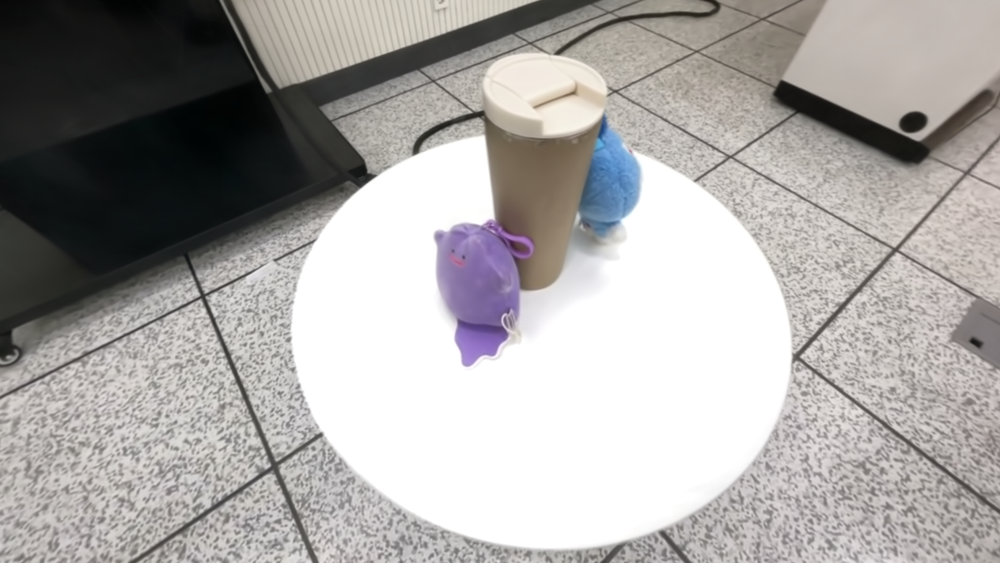

  <h1>3DGS Object Removal</h1>
  
<strong>클래스 라벨을 학습해 특정 객체를 제거하는 실험</strong>

## 실험 의도

장면 속 객체에 클래스 라벨을 부여하고, 해당 라벨을 학습한 3DGS에서 원하는 객체만 제거하려고 했습니다. 두 인형을 제거하면서 컵과 테이블, 주변 배경은 유지하는 것이 목표였습니다.

## 라벨링과 객체 제거

SAM2로 객체별 마스크를 만들고, 이를 라벨로 사용해 Gaussian별 객체 점수를 학습했습니다. 학습 후 두 인형의 라벨에 해당하는 Gaussian을 제외하고 다시 렌더링했습니다.

<table class="teaser">
  <tr>
    <th align="center">클래스 라벨링</th>
    <th align="center">제거 전</th>
    <th align="center">두 인형의 라벨 제거 후</th>
  </tr>
  <tr>
    <td></td>
    <td></td>
    <td></td>
  </tr>
</table>

## 결과와 확인한 문제

선택한 라벨을 제거하면 두 인형의 형태와 색이 크게 줄어드는 것을 확인했습니다. 하지만 **객체를 제거할 때 주변 배경의 일부까지 함께 사라지는 문제**가 나타났고, 인형의 일부 흔적도 남았습니다.

원하는 객체만 제거하면서 나머지 장면을 보존하려면, 객체와 배경을 더 정확히 구분해 학습할 필요가 있습니다.

### 다른 시점에서도 나타나는 문제

<table class="secondary">
  <tr><th align="center">제거 전</th><th align="center">제거 후 — 객체 흔적과 배경 손상</th></tr>
  <tr>
    <td></td>
    <td></td>
  </tr>
</table>

## 제거 전·후 비교

같은 카메라 시점과 렌더링 설정으로 비교했습니다.

<figure class="result">
  <figcaption><strong>제거 전</strong></figcaption>
  
</figure>

<figure class="result">
  <figcaption><strong>제거 후</strong> — 두 인형의 라벨에 해당하는 Gaussian 제외</figcaption>
  
</figure>

객체 주변과 화면 상단의 배경에도 빈 영역이 생긴 것을 확인할 수 있습니다.
