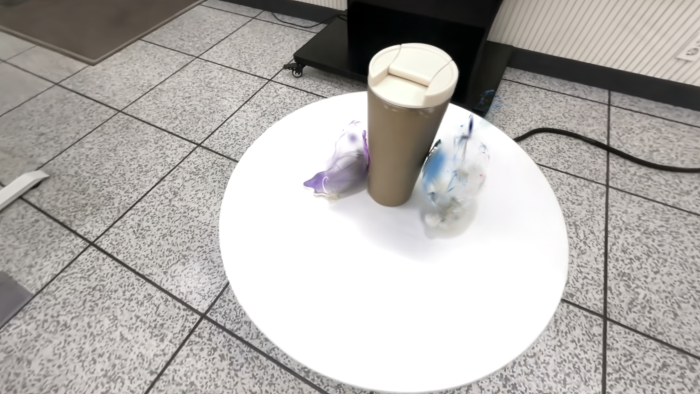

  <h1>3DGS Object Removal</h1>
  
<strong>클래스 라벨링을 통한 객체 제거와 배경 손상 개선</strong>

## 1. 클래스 라벨을 학습해 객체 제거

장면 속 객체에 클래스 라벨을 부여하고, 원하는 객체만 제거하는 실험을 진행했습니다. 두 인형을 제거하면서 컵과 테이블, 주변 배경은 유지하는 것이 목표였습니다.

SAM2 마스크를 정답 라벨로 사용해, **RGB 재구성 손실에 객체 클래스 손실(Object Class Loss)을 추가**했습니다. 렌더링한 클래스 점수와 정답 라벨의 교차 엔트로피로 객체 라벨을 함께 학습하고, 학습 후 두 인형에 해당하는 Gaussian을 삭제했습니다.

<table class="teaser">
  <tr>
    <th align="center">클래스 라벨링</th>
    <th align="center">원본 장면</th>
    <th align="center">라벨에 따른 객체 제거</th>
  </tr>
  <tr>
    <td></td>
    <td></td>
    <td></td>
  </tr>
</table>

## 2. 객체와 함께 배경도 사라지는 문제

인형의 형태와 색은 크게 줄었지만, **객체를 제거할 때 주변 배경의 일부까지 함께 사라지는 문제**가 나타났습니다. 인형의 라벨에 해당하는 Gaussian을 모두 삭제하면서 바닥과 화면 상단의 배경에도 빈 영역이 생겼습니다.

## 3. 여러 시점의 마스크로 삭제 대상을 검증

이 문제를 줄이기 위해 기존 라벨 학습은 유지하고, **삭제 전에 여러 시점의 객체 마스크로 후보를 검증하는 단계**를 추가했습니다.

각 후보가 실제 렌더링에서 객체 안쪽과 주변 영역에 얼마나 기여하는지 확인했습니다. 여러 시점에서 객체에 해당한다고 확인된 후보만 삭제하고, 다른 시점에서 배경을 그리는 데 기여하는 후보는 보호했습니다.

<table class="secondary">
  <tr>
    <th align="center">기존 객체 제거 — 주변 배경도 사라짐</th>
    <th align="center">마스크 검증 후 객체 제거 — 배경 손상 개선</th>
  </tr>
  <tr>
    <td></td>
    <td></td>
  </tr>
</table>

검증 단계를 추가하자 **객체 제거 시 주변 배경이 함께 사라지는 현상이 크게 줄었습니다.** 컵과 테이블, 주변 배경은 보존됐으며, 인형의 일부 흔적은 남았습니다.

## 객체 제거 결과 비교

같은 카메라 시점과 렌더링 설정으로 기존 방식과 검증을 추가한 방식을 비교했습니다.

<figure class="result">
  <figcaption><strong>기존 객체 제거</strong> — 선택한 라벨의 Gaussian을 모두 삭제</figcaption>
  
</figure>

<figure class="result">
  <figcaption><strong>마스크 검증 후 객체 제거</strong> — 여러 시점에서 확인된 후보만 삭제</figcaption>
  
</figure>

## 코드와 학습 라벨

| 파일 | 내용 |
| --- | --- |
| [train.py](train.py) | RGB 재구성과 Object Class Loss를 함께 학습 |
| [scene/gaussian_model.py](scene/gaussian_model.py) | Gaussian별 클래스 점수 관리·저장 |
| [local_tools/sam2_segment_image.py](local_tools/sam2_segment_image.py), [sam2_track_object.py](local_tools/sam2_track_object.py) | SAM2 객체 마스크 생성·전파 |
| [local_tools/merge_sam2_object_masks.py](local_tools/merge_sam2_object_masks.py) | 객체별 마스크를 클래스 라벨로 병합 |
| [labels](labels) | 실제 학습 마스크 438장과 클래스 번호 정의 |
| [local_tools/filter_ply_by_object_logit.py](local_tools/filter_ply_by_object_logit.py) | 선택한 라벨의 Gaussian을 삭제 |
| [local_tools/validate_removal_multiview.py](local_tools/validate_removal_multiview.py) | 여러 시점 마스크로 삭제 후보를 검증하고 결과 렌더링 |

환경 설정부터 학습·객체 제거까지의 실행 방법은 [WORKFLOW](docs/WORKFLOW.md)에 정리했습니다. 기반 코드와 라이선스는 [NOTICE](NOTICE.md), [LICENSE](LICENSE.md)를 참고하세요.
