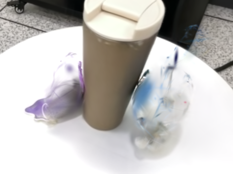
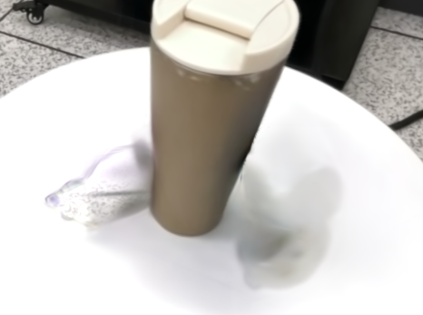
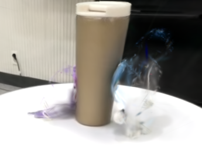
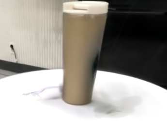

  <h1>3DGS Object Removal</h1>
  
<strong>Object removal and background preservation through class labeling</strong>

## 1. Object Removal and Background Preservation with Learned Class Labels

We aimed to remove two plush toys while preserving the cup, table, and surrounding background.

### 1) Class Labeling

We used SAM2 to generate and track object masks in the captured frames, then assigned class IDs to the two plush toys, cup, and table.

### 2) Object Class Training

We **added Object Class Loss to the RGB reconstruction loss**. Gaussian class labels were learned by comparing rendered class scores with the reference masks using cross entropy.

### 3) Removal by Class Label

We deleted Gaussians assigned to the two plush toys. Their shapes and colors were reduced, but **parts of the surrounding background disappeared as well**.

<table class="teaser">
  <tr>
    <th align="center">Class Labeling</th>
    <th align="center">Original Scene</th>
    <th align="center">Removal by Class Label</th>
  </tr>
  <tr>
    <td></td>
    <td></td>
    <td></td>
  </tr>
</table>

### 4) Validation Across Views and Background Preservation

To reduce this damage, we **measured each candidate Gaussian's contribution inside the object masks and in the surrounding regions across multiple views**. We removed candidates that consistently contributed to the objects. Candidates with limited evidence or contributions to surrounding regions in other views were retained to protect the background.

<table class="secondary">
  <tr>
    <th align="center">Initial Removal — Background Damage</th>
    <th align="center">Removal After Validation — Background Preserved</th>
  </tr>
  <tr>
    <td></td>
    <td></td>
  </tr>
</table>

Validation **greatly reduced damage to the surrounding background**. However, retaining some Gaussians to protect the background meant that **visible traces of the objects still remained**.

## 2. Learning Removal Strength and Directional Corrections

To reduce the remaining traces, we extended the approach to **learn how much to lower each Gaussian's opacity**.

### 1) From Deletion to Opacity Adjustment

We **lowered opacity according to a learned removal strength**. Higher strength makes a Gaussian more transparent; lower strength keeps more of its original opacity.

### 2) Learning a Shared Removal Strength

We initialized removal strength from the existing class predictions and learned a shared value for each Gaussian using object masks from multiple views. The aim was to **suppress the objects while retaining regions outside their masks**. The original scene geometry and colors were fixed.

### 3) Directional Corrections

We added **a small correction based on the camera direction** to the shared removal score. The resulting strength controls opacity and can be used at new viewpoints without a mask for that view.

### 4) Rendering with Adjusted Opacity

<table class="teaser">
  <tr>
    <th align="center">Validation Across Views</th>
    <th align="center">Shared Removal Strength</th>
    <th align="center">With Directional Corrections</th>
  </tr>
  <tr>
    <td></td>
    <td></td>
    <td></td>
  </tr>
</table>

<table class="secondary">
  <tr>
    <th align="center">Another View — Validation Across Views</th>
    <th align="center">Another View — Removal Strength and Corrections</th>
  </tr>
  <tr>
    <td></td>
    <td></td>
  </tr>
</table>

## Code and Training Labels

| File | Description |
| --- | --- |
| [train.py](train.py) | Training with RGB reconstruction and Object Class Loss |
| [scene/gaussian_model.py](scene/gaussian_model.py) | Managing and saving Gaussian class scores |
| [local_tools/sam2_segment_image.py](local_tools/sam2_segment_image.py), [sam2_track_object.py](local_tools/sam2_track_object.py) | Generating and tracking SAM2 object masks |
| [local_tools/merge_sam2_object_masks.py](local_tools/merge_sam2_object_masks.py) | Merging object masks into class labels |
| [labels](labels) | 438 training masks and class ID definitions |
| [local_tools/filter_ply_by_object_logit.py](local_tools/filter_ply_by_object_logit.py) | Deleting Gaussians with selected class labels |
| [local_tools/validate_removal_multiview.py](local_tools/validate_removal_multiview.py) | Validating removal candidates across views and rendering results |
| [local_tools/align_colmap_class_masks.py](local_tools/align_colmap_class_masks.py) | Aligning masks with COLMAP images after lens distortion correction |
| [local_tools/train_removal_gate.py](local_tools/train_removal_gate.py) | Learning shared removal strength and directional corrections |
| [local_tools/render_removal_gate.py](local_tools/render_removal_gate.py) | Rendering a learned removal checkpoint without a mask for the current view |

See [WORKFLOW](docs/WORKFLOW.md) for setup, training, and object removal instructions. See [NOTICE](NOTICE.md) and [LICENSE](LICENSE.md) for the upstream code and license.
