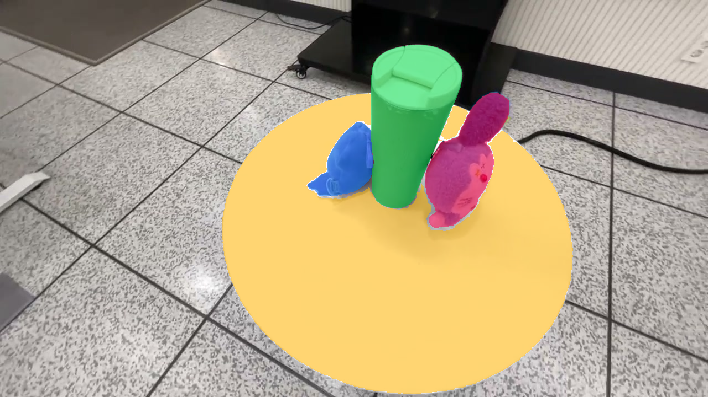
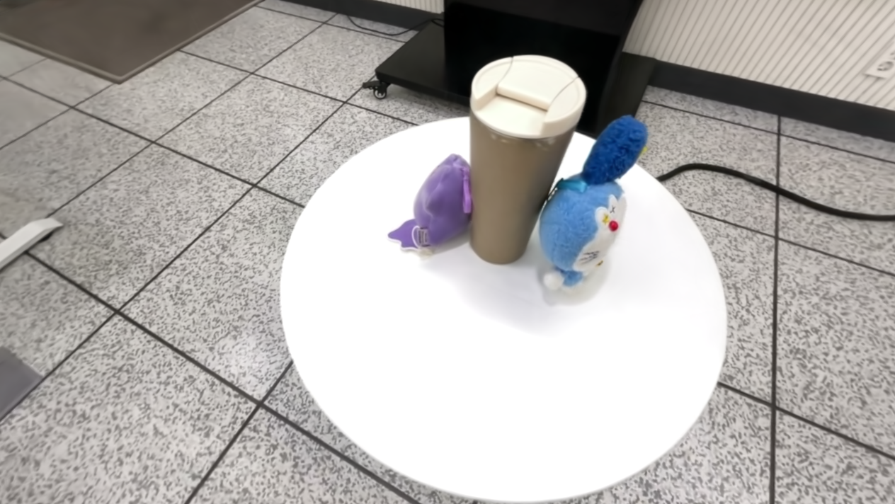
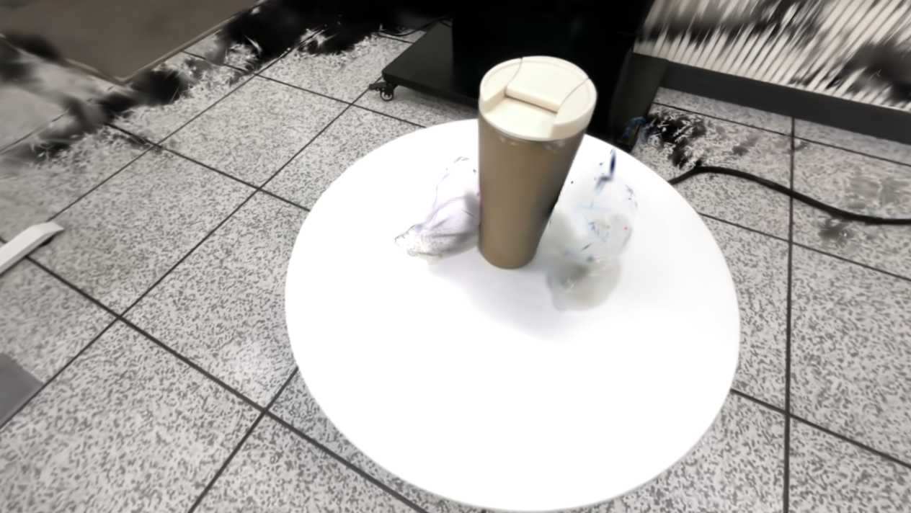
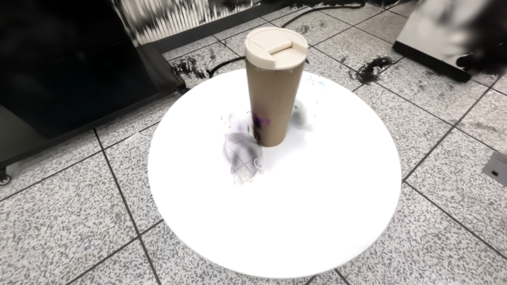
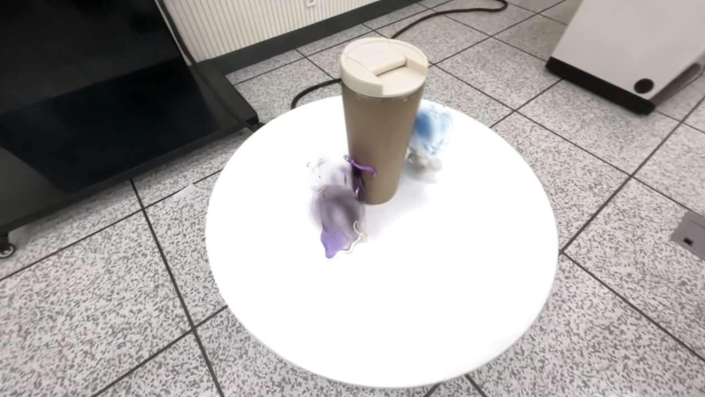

  <h1>3DGS Object Removal</h1>
  
<strong>클래스 라벨링을 통한 객체 제거와 배경 손상 개선</strong>

## 1. 클래스 라벨을 학습해 객체 제거 및 배경보존

두 인형을 제거하면서 컵과 테이블, 주변 배경은 유지하는 것을 목표로 실험했습니다.

### 1) 클래스 라벨링

원본 촬영 프레임에서 SAM2로 객체 마스크를 생성·추적하고, 두 인형과 컵, 테이블에 클래스 번호를 부여했습니다.

### 2) 객체 클래스 학습

**RGB 재구성 손실에 객체 클래스 손실(Object Class Loss)을 추가**했습니다. 렌더링한 클래스 점수와 정답 마스크의 교차 엔트로피로 Gaussian별 객체 라벨을 함께 학습했습니다.

### 3) 라벨 기반 객체 제거

학습한 라벨을 기준으로 두 인형에 해당하는 Gaussian을 삭제했습니다. 인형의 형태와 색은 줄었지만, **주변 배경까지 함께 사라지는 문제**가 나타났습니다.

<table class="teaser">
  <tr>
    <th align="center">클래스 라벨링</th>
    <th align="center">원본 장면</th>
    <th align="center">라벨에 따른 객체 제거</th>
  </tr>
  <tr>
    <td></td>
    <td></td>
    <td></td>
  </tr>
</table>

### 4) 여러 시점 검증 후 객체 제거 및 배경보존

이 문제를 줄이기 위해 **여러 시점에서 삭제 대상 라벨의 Gaussian이 객체 마스크 안쪽과 주변 영역에 기여하는 양을 계산**했습니다. 여러 시점에서 객체에 일관되게 기여하는 후보만 삭제하고, 특정 시점에서만 객체에 기여해 확인 근거가 부족하거나 다른 시점에서 주변 영역을 그리는 데 기여하는 Gaussian은 보존해 배경을 보호했습니다.

<table class="secondary">
  <tr>
    <th align="center">기존 객체 제거 — 주변 배경도 사라짐</th>
    <th align="center">마스크 검증 후 객체 제거 — 배경 손상 개선</th>
  </tr>
  <tr>
    <td></td>
    <td></td>
  </tr>
</table>

검증 단계를 추가하자 **객체 제거 시 주변 배경이 함께 사라지는 현상이 크게 줄었습니다.** 컵과 테이블, 주변 배경은 보존됐으며, 인형의 일부 흔적은 남았습니다.

## 코드와 학습 라벨

| 파일 | 내용 |
| --- | --- |
| [train.py](train.py) | RGB 재구성과 Object Class Loss를 함께 학습 |
| [scene/gaussian_model.py](scene/gaussian_model.py) | Gaussian별 클래스 점수 관리·저장 |
| [local_tools/sam2_segment_image.py](local_tools/sam2_segment_image.py), [sam2_track_object.py](local_tools/sam2_track_object.py) | SAM2 객체 마스크 생성·전파 |
| [local_tools/merge_sam2_object_masks.py](local_tools/merge_sam2_object_masks.py) | 객체별 마스크를 클래스 라벨로 병합 |
| [labels](labels) | 실제 학습 마스크 438장과 클래스 번호 정의 |
| [local_tools/filter_ply_by_object_logit.py](local_tools/filter_ply_by_object_logit.py) | 선택한 라벨의 Gaussian을 삭제 |
| [local_tools/validate_removal_multiview.py](local_tools/validate_removal_multiview.py) | 여러 시점 마스크로 삭제 후보를 검증하고 결과 렌더링 |

환경 설정부터 학습·객체 제거까지의 실행 방법은 [WORKFLOW](docs/WORKFLOW.md)에 정리했습니다. 기반 코드와 라이선스는 [NOTICE](NOTICE.md), [LICENSE](LICENSE.md)를 참고하세요.
